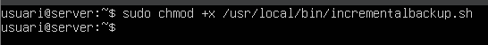
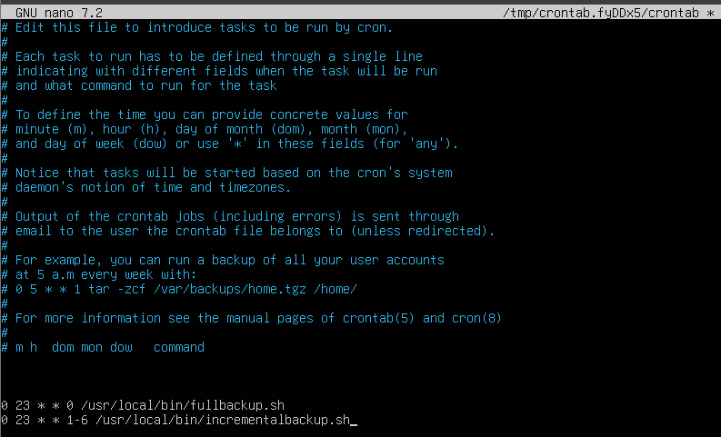

# Part 2 — Còpia de seguretat a Linux amb Duplicity + cron
Objectiu: configurar còpies completes i incrementals del directori /home en un volum extern muntat manualment a /media/backup. La documentació ha d’incloure les captures de pantalla de cada etapa, i el text no ha de contenir comandos.

Seqüència de la prova de concepte
Preparació de la unitat de còpia (10 GB): detecció del disc, formatació a XFS i creació del punt de muntatge.

Formatació en XFS i habilitació del punt de muntatge

Es defineix el sistema de fitxers i el punt de muntatge per a la unitat auxiliar.

Muntatge manual a /media/backup.

Crear usuaris.

El volum queda disponible per rebre còpies de seguretat.

Instal·lació de Duplicity.

Instal·lar duplicity

Instal·lació de l'eina de còpia per entorns Linux.

Preparació de dades de prova: creació d’usuaris addicionals i generació de fitxers de 10 MB dins de /home

Fitxers de prova creats

Creem usuaris i contingut per validar les còpies.

Fer una còpia completa de /home cap a la unitat de backup.

Backup complet /home Verificar contingut backup

Validació de la restauració: eliminació i recuperació de fitxers

Esborrar fitxers Restore complet

Es simula una pèrdua de dades i es verifica la recuperació.

Fer una còpia incremental després d'afegir un fitxer de ~4 MB.

Crear nou fitxer Backup incremental Comprovació versions

Es genera un canvi menor i s'executa una còpia incremental per observar diferències.

Desmuntar la unitat de backup.

Desmuntar

La unitat queda desconnectada per seguretat.

Automatització amb scripts i cron (captures del procés).

Creació dels scripts i assignació de permiso
Es generen els scripts necessaris i se’ls dóna permís d’execució.

Edició del fitxer crontab per programar les tasques
S’incorporen les ordres de còpia programada, incloent-hi la incremental.

