# Part 2 — Còpia de seguretat a Linux amb Duplicity + cron
Objectiu: implementar còpies completes i incrementals de /home en un volum auxiliar muntat manualment a /media/backup, mostrant-ho amb captures i sense comandos en el text.

Seqüència de la prova de concepte
Preparació de la unitat de backup (10 GB): detectar el disc, formatejar en XFS, crear punt de muntatge.
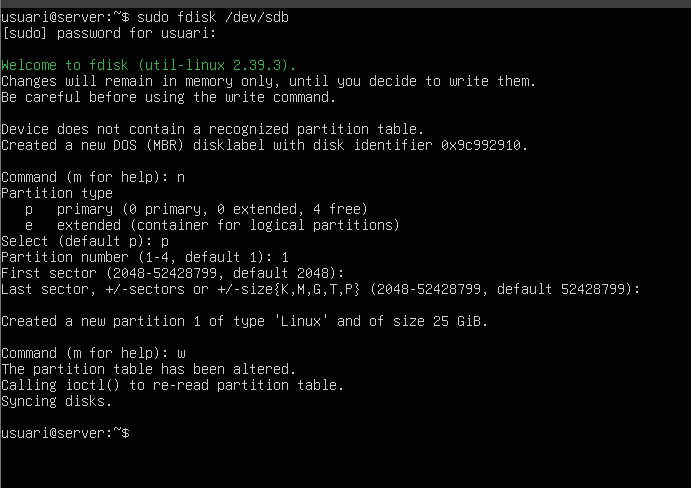

Formatar XFS Crear punt de muntatge
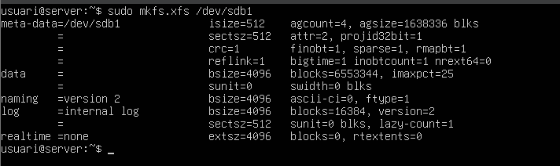

Es defineix el sistema de fitxers i el punt de muntatge per a la unitat auxiliar.

Muntatge manual a /media/backup.

Crear usuaris.
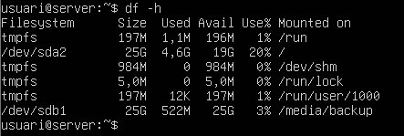

El volum queda disponible per rebre còpies de seguretat.

Instal·lació de Duplicity.

Instal·lar duplicity
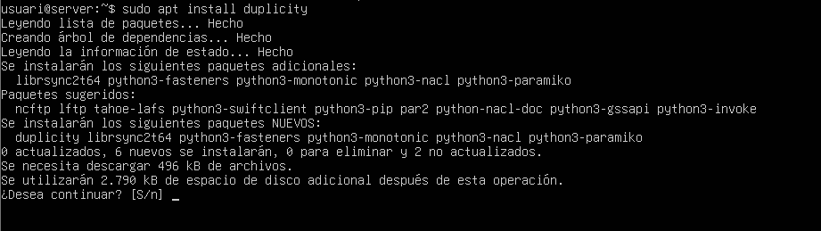

Instal·lació de l'eina de còpia per entorns Linux.

Preparar dades de prova: crear usuaris addicionals i fitxers de 10 MB en home.
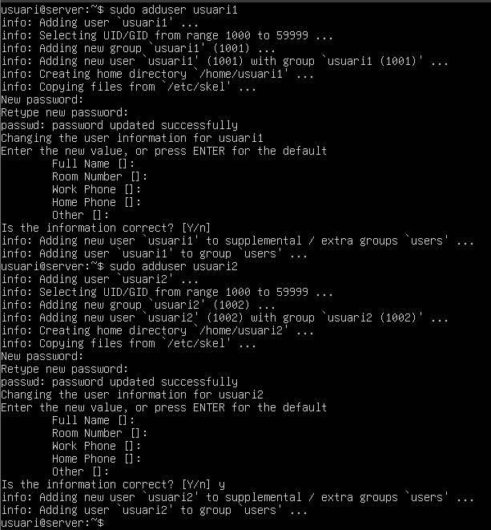

Crear fitxers de prova

Creem usuaris i contingut per validar les còpies.

Fer una còpia completa de /home cap a la unitat de backup.

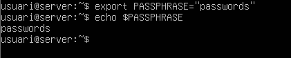

Backup complet /home Verificar contingut backup

Verificar restauració: esborrar i restaurar fitxers.

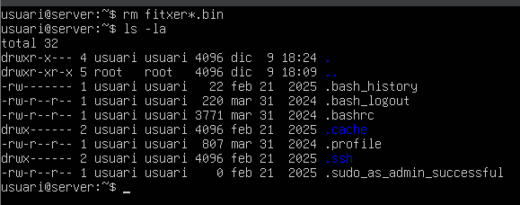

Esborrar fitxers Restore complet

Es simula una pèrdua de dades i es verifica la recuperació.

Fer una còpia incremental després d'afegir un fitxer de ~4 MB.

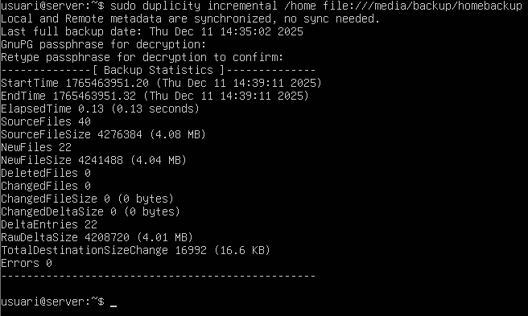

Crear nou fitxer Backup incremental Comprovació versions

Es genera un canvi menor i s'executa una còpia incremental per observar diferències.

Desmuntar la unitat de backup.
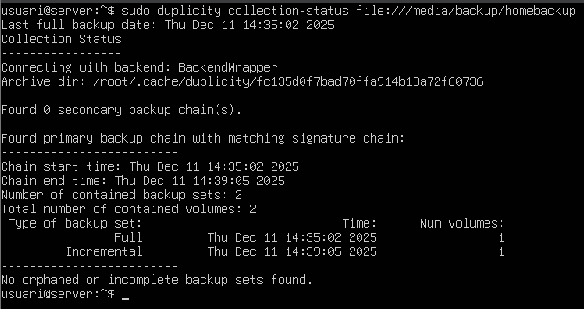

Desmuntar

La unitat queda desconnectada per seguretat.

Automatització amb scripts i cron (captures del procés).

Creem els scripts i donem permisos Permisos execució Permisos execució Permisos execució Permisos execució

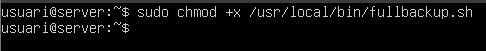

Obrim el arxiu de crontab per posar las tascas que volem que cron executi Permisos execució Cron incremental

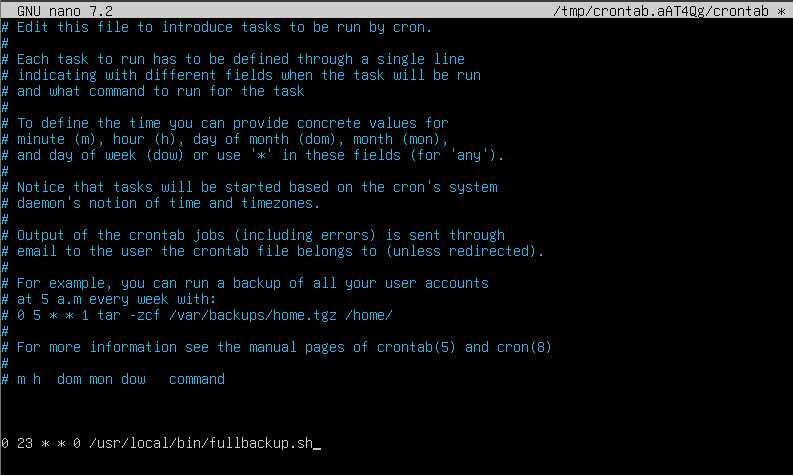
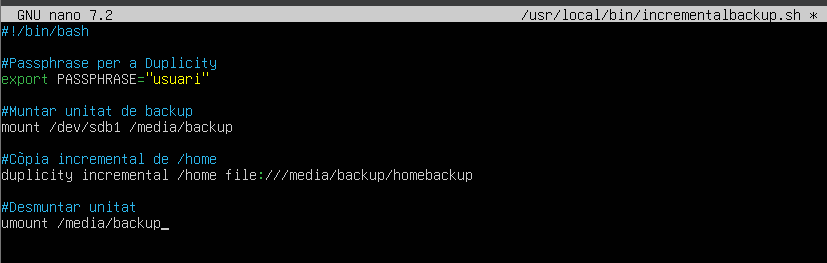

