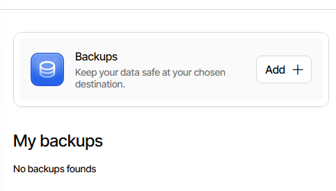
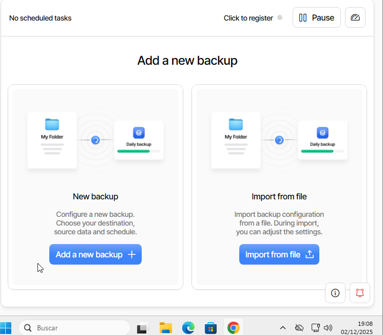
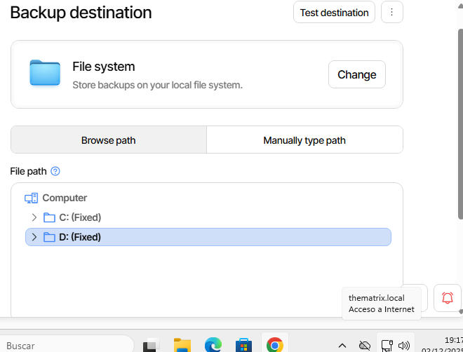
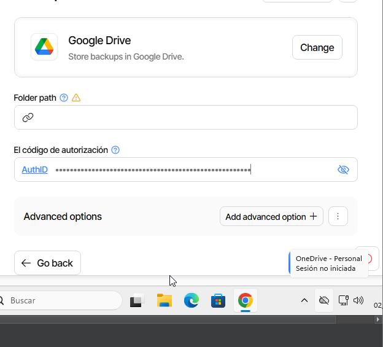
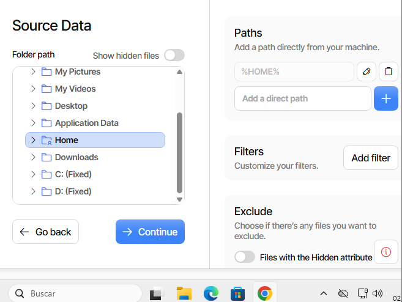
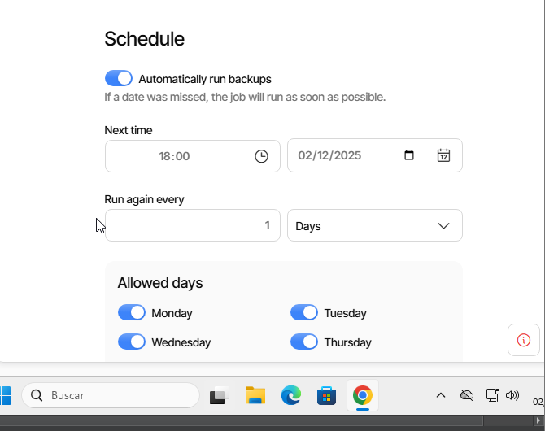
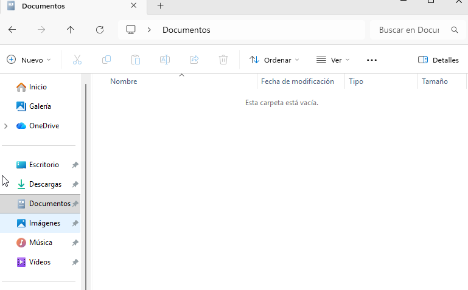
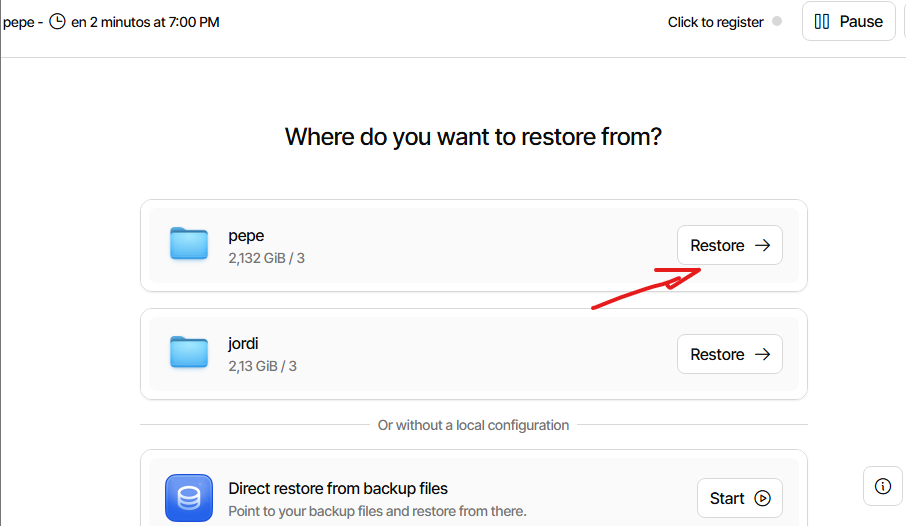
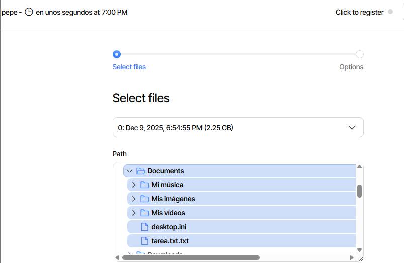
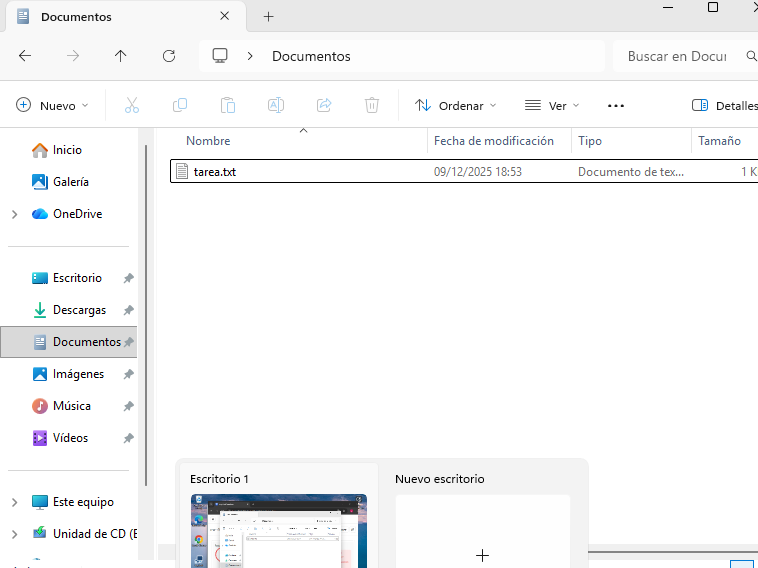

Part 1: Còpia seguretat dels equips clients Windows

Primer de tot ens descarregarem google per poder installar-nos el Duplicati

Instalarem la versio per el nostre equip, en aquest cas instalarem la versió per windows

Crear volum simple

Un cop que tinguem instalat el archiu.exe l'executarem i farem siguiente siguiente, aceptant els termes neccesaris fins que tinguem el duplicati instalat correctament

Instalació duplicati

Un cop instalat, s'obrira una pestanya en el nostre navegador en el qual ens demanara que escollim una constrasenya per fer servir duplicati.

En la qual podem escollir qualsevol contrasenya ja que sera personal, important no olvidar-la

duplicati

Un cop que ja tenim el duplicati, crearem alguns documents de proba per poder fer la copia de seguretat

Creació de documents

El seguent pas sera configurar les copies de seguretat que voldrem, aixi que começarem escollint la opcio de backup add i add new backup,

Un cop aqui haurem de colocar les dades de la nostra copia

duplicati

El seguent pas sera escollir on tindrem guardada la copia, en aquest cas la guardarem en el nostre cas la guardarem en el disc secundari

Escollir lloc

Un cop fet això hem d'escollir quins documents volem fer la copia

Escollir documents

Tot seguit haurem d'escollir cada quan de temps volem que és realitzi la copia, en aquest cas la farem cada 1 hora

Escollir temps

Un cop que arribem aqui escollirem les opcions que en demani i un cop fet, ja tindrem la nostra copia creada

opcions

El proxim pas sera fer el mateix però amb l'unic canvi que farem la copia en el nuvol, en aquest cas farem servir el google drive, per fer-ho farem el seguent però unicament modificarem el seguent.

El lloc en el qual guardarem la copia, en la qual haurem de vincular la conta, per fer això farem click a AuthID

googledrive

L'altre cosa que haurem d'editar sera cada quan és fa la copia, en aquest cas sera cada dia a las 6 de la tarda

Horari

Un cop fet aixo ja tindrem les dues copies creades

copies creades

El seguent pas que farem sera borrar els documents de proba per poder comprobar que podem recuperar la copia correctament

Carpeta documents

Un cop que ja hem borrat els documents, el seguent pas sera recuperar la copia, per poder fer això anirem a "Restores" i farem click a "Start"

Escollirem la copia que volem restaurar, en aquest cas proba

Escollir copia

escollirem els fitxers que volem restaurar, en aquest cas la carpeta documents

Escollir documents

Farem siguiente siguiente i un cop fet això ja tindrem feta la restauració

Restauració feta

Restauració feta

Per poder restaurar la copia que hem fet a google drive ho farem igual però selecionarem l'altre copia

