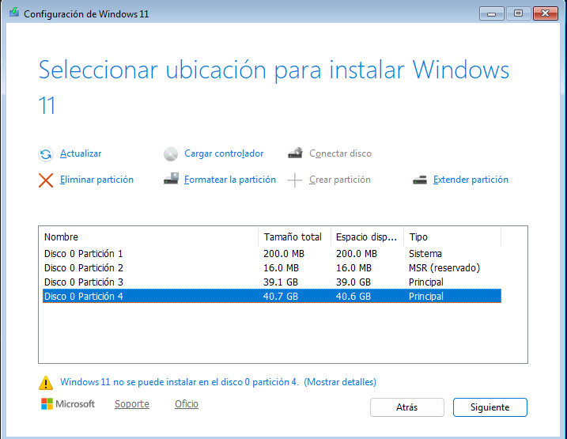

# Part 1: Còpia seguretat dels equips clients Windows

Primer de tot ens descarregarem google per poder installar-nos el Duplicati

Instalarem la versio per el nostre equip, en aquest cas instalarem la versió per windows

Un cop dins li donarem a l'opció de Backups

Crearem un document per poder fer la còpia de seguretat 

Un cop dins tindrem que possar les dades de la nostre còpia de seguretat

Despres tindrem que escollir on guardar la copia, en aquest cas la guardarem en el nostre disc secundari

Un cop fet això hem d'escollir quins documents volem fer la copia en aquest cas sera Home 

Despres haurem d'escollir quan de temps volem que és realitzi la copia, en aquest cas la farem cada 1 hora

El proxim pas sera fer el mateix però amb l'unic canvi es que farem la copia en el nuvol, fent servir google drive.
El lloc en el qual guardarem la copia, en la qual haurem de vincular la conta, per fer això farem click a AuthID

L'altre cosa que haurem d'editar sera cada quan és fa la copia, en aquest cas sera cada dia a las 6 de la tarda

Un cop fet aixo ja tindrem les dues copies creades

El seguent pas que farem sera borrar els documents de proba per poder comprobar que podem recuperar la copia correctament

Escollirem la copia que volem restaurar, en aquest cas pepe

escollirem els fitxers que volem restaurar, en aquest cas la carpeta documents

Com podem veure ja tornem a tenir el document 

