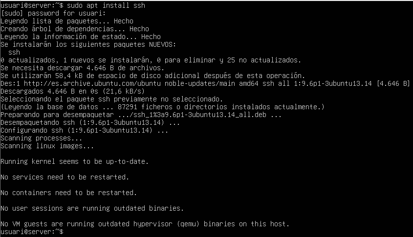
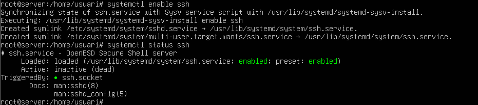
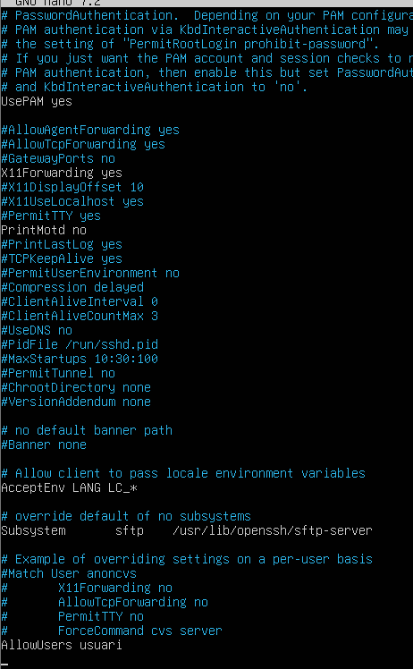
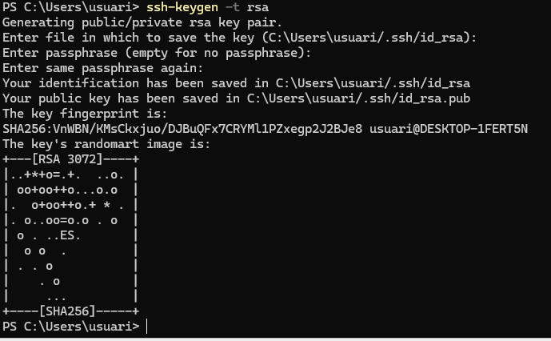
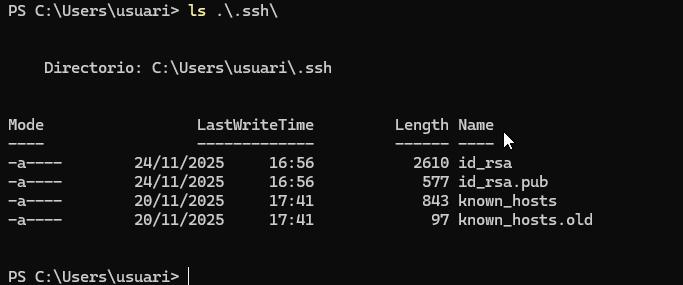
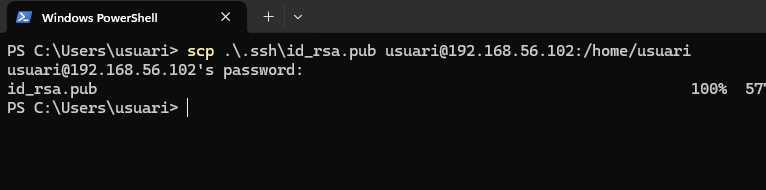
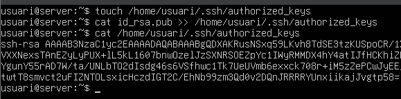
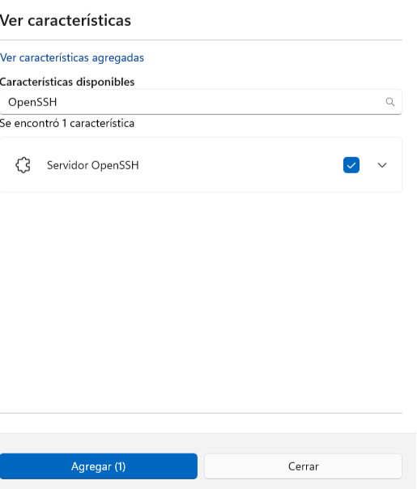
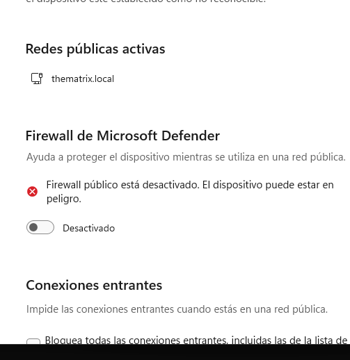
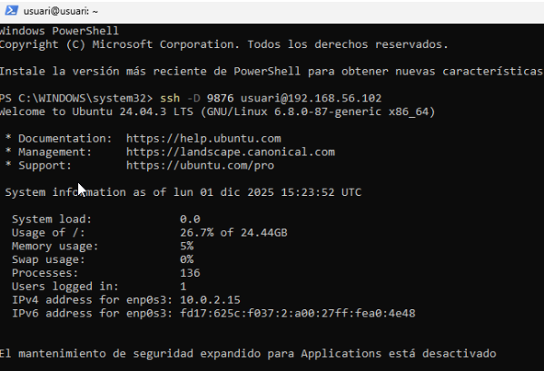

# Guia d’instal·lació i configuració SSH (Ubuntu ↔ Windows)
---

## **Instal·lar el servei SSH a Ubuntu**

Instal·lem l’SSH des d’Ubuntu:


```bash
sudo apt install openssh-server
```

Activem el servei SSH:


```bash
sudo systemctl enable ssh
sudo systemctl start ssh
```

Comprovem que el servei està actiu:

```bash
systemctl status ssh
```

---

## **Primera connexió SSH i validació del certificat**

Fem:


per veure la IP de l’adaptador **només amfitrió** a Ubuntu.

Des de Windows (PowerShell/Terminal):


```bash
ssh nom_ubuntu@IP_ubuntu
```


Apareixerà un avís demanant acceptar la clau del servidor (`yes`) i després la contrasenya.

---

## **Habilitar l’usuari root a Ubuntu**

Assignem contrasenya a `root`:

```bash
sudo passwd root
```


Introdueix la contrasenya actual i després la nova (exemple: `usuari`).

---

## **Configurar sshd_config per permetre només certs usuaris**

A Ubuntu obrim:

```bash
sudo nano /etc/ssh/sshd_config
```


Afegim:

```
AllowUsers nom_usuari
```


Reiniciem el servei SSH:

```bash
sudo systemctl restart ssh
```

---

## **Comprovació: root pot iniciar sessió local però no remotament**

Login local a Ubuntu:

```bash
su -
```


Des de Windows:

```bash
ssh root@IP_ubuntu
```


Resposta esperada: **Access denied**

---

## **Configurar SSH amb certificat en lloc de contrasenya**

### 1. Generar claus RSA des de Windows

```bash
ssh-keygen -t rsa -b 4096
```


Apareixen dos fitxers, per exemple:

* `id_rsa`
* `id_rsa.pub`  ← **aquest és el que hem de copiar a Ubuntu**



### 2. Copiar la clau pública a Ubuntu

```bash
scp id_rsa.pub nom_ubuntu@IP_ubuntu:/home/nom_ubuntu/
```


### 3. Afegir la clau al fitxer authorized_keys

A Ubuntu:

```bash
touch ~/.ssh/authorized_keys
cat ~/id_rsa.pub >> ~/.ssh/authorized_keys

```


Ara, des de Windows:

```bash
ssh nom_ubuntu@IP_ubuntu
```


Ja no hauria de demanar contrasenya.

---

## **Configurar el servidor OpenSSH a Windows 11**

1. Obrir **Configuració** → **Sistema**

   


2. Entrar a **Característiques opcionals**

    


3. Clicar **Veure característiques disponibles**

    


4. Buscar **OpenSSH Server**

    


5. Marcar-lo i fer *Afegir*

---

## **Activar el servei OpenSSH a Windows**

A PowerShell (com administrador):


powershell
Set-Service -Name sshd -StartupType Automatic
Start-Service sshd


Desactivar firewall (per a la pràctica):

```
Firewall i protecció de xarxa → Xarxa pública → Desactivar
```





Veure IP Windows “només amfitrió”:

```powershell
ipconfig
```


---

## **Connexió remota des d’Ubuntu cap a Windows**

### 1. Comprovar ping

```bash
ping IP_windows
```


### 2. Connexió SSH

```bash
ssh nom_windows@IP_windows
```


---

## **Crear un túnel com el de la guia**




---

## **Configuració del túnel *proxy* a Windows**

(Configura’l segons els paràmetres del túnel creat.)

---
