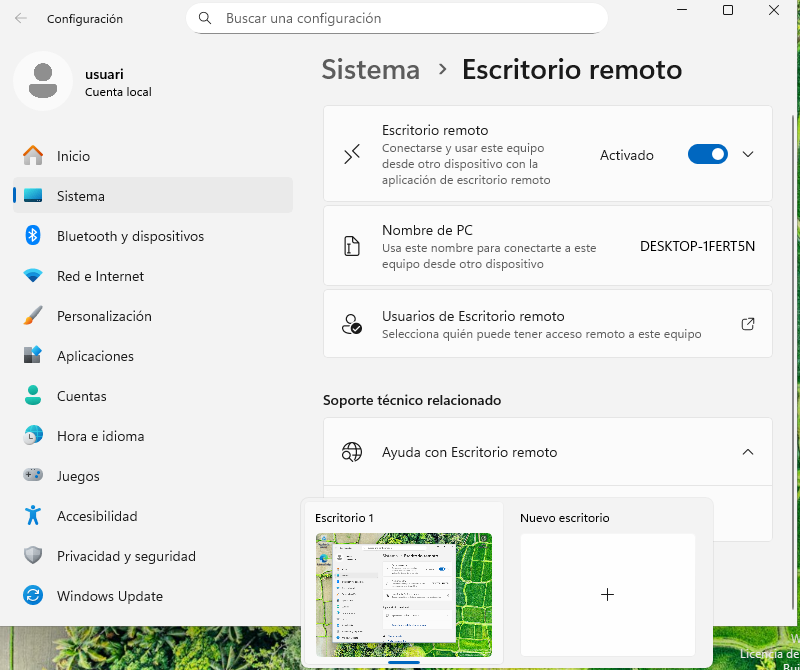
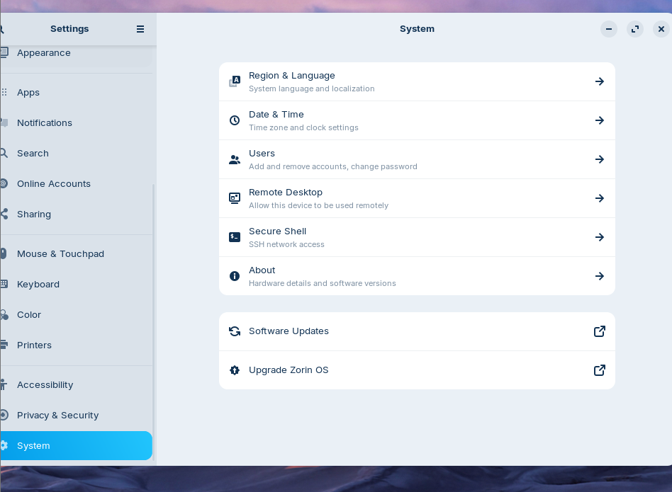
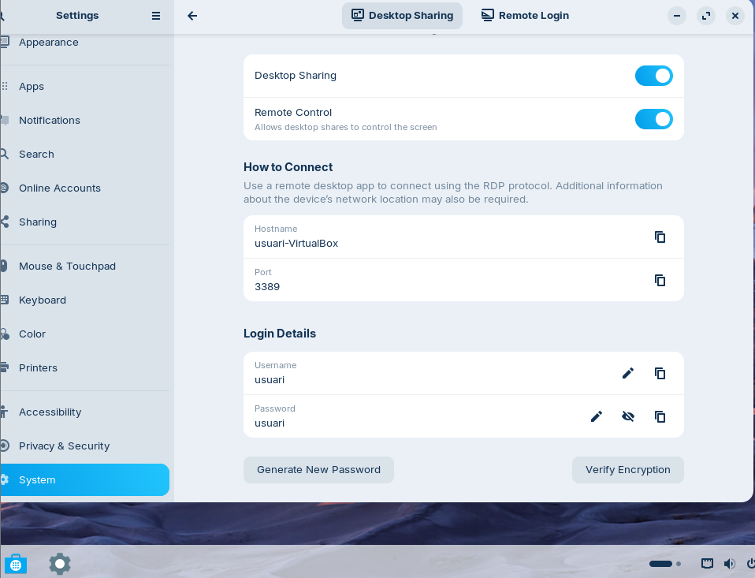
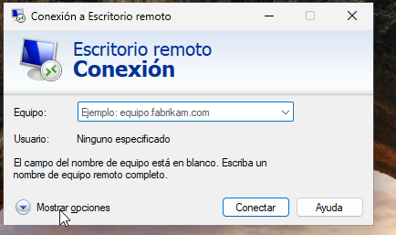
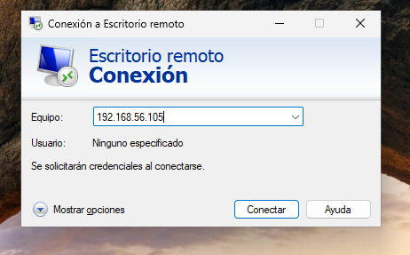
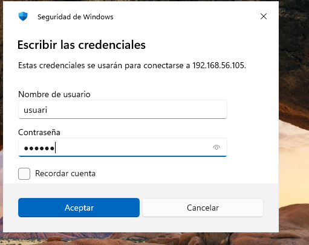
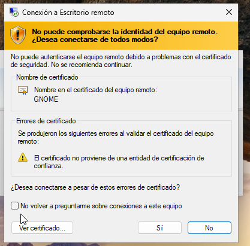
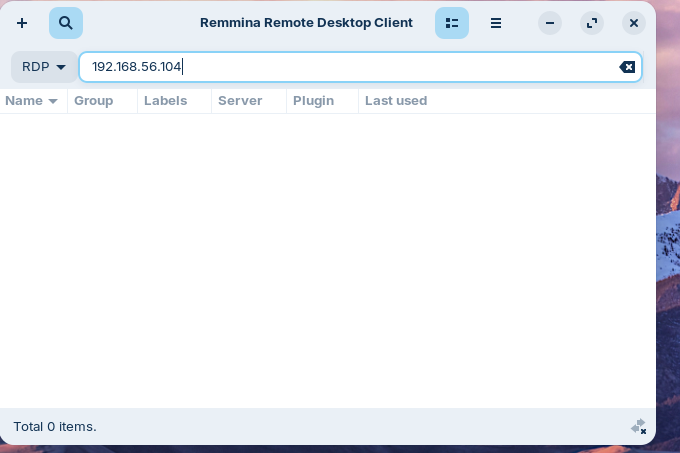
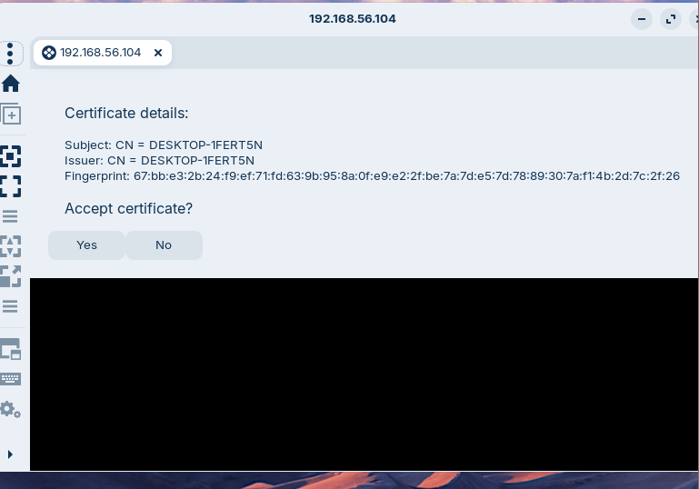

# T06: Accés Remot — Escriptori Remot (RDP) (tasca individual)

Primer de tot tindrem que cambiar la configuració de la xarxa a les dues màquines afegint host-only.

# Configuració de la màquina Windows
Desprès en la màquina windows busquem configuració d'escriptori remot.
Un cop a dins activem l'opció que ens surt.

Un cop activada ja ens podrem conectar desde la màquina Zorin.

--- 
# Configuració de la màquina Zorin

Tindrem que anar a Settings > Remote Desktop.

I aquí activem l'opció de Desktop Sharing i Remote Control,

# Connexió des de la màquina Windows a la màquina Zorin
Per a connectar-nos des de la màquina Windows a la màquina Zorin, utilitzem l'eina de Conexión a Escritorio Remoto

Aquí introduïm la IP de la màquina Zorin

Ens demanarà que posem les credencials de la màquina Zorin.

Ens sortira una finestra d'advertència de certificat, i li donarem a Sí.

I podrem veure que ja estem conectats.

# Connexió des de la màquina Zorin a la màquina Windows
Per a connectar-nos des de la màquina Zorin a la màquina Windows, utilitzem l'eina Remmina

Aquí introduïm la IP de la màquina Windows

Ens sortira una advertencia i li donarem a Si.

I ens demana les credencials d'usuari de la màquina Windows

I ja podem veure que estem conectats 

