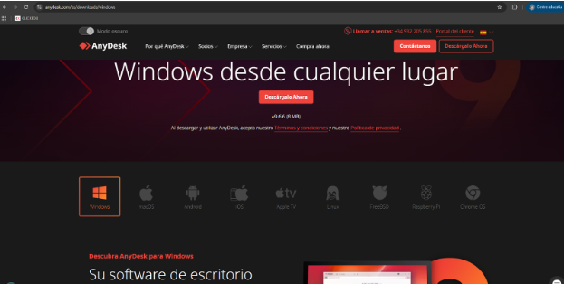
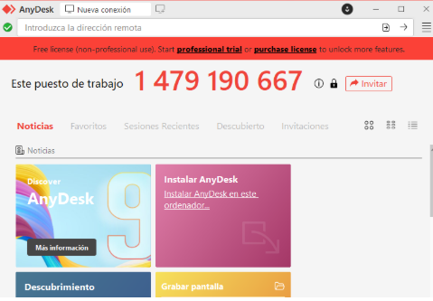
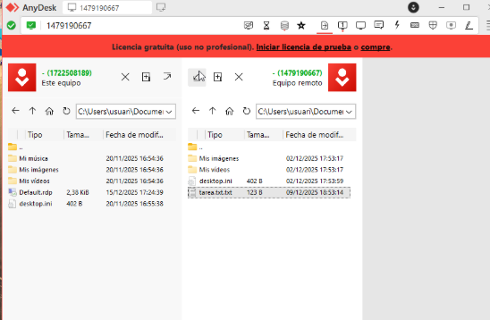
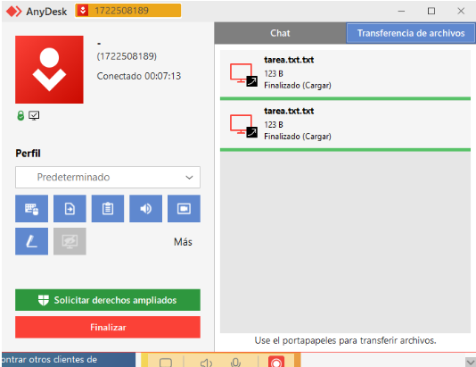
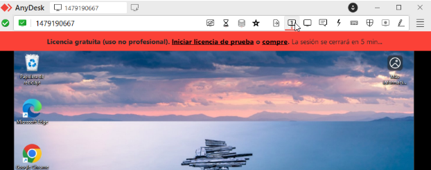
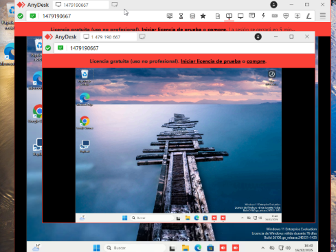
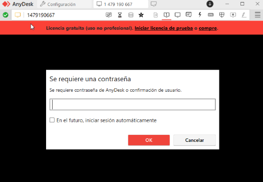

# **Fase 2**  

Descargar anydesk per el sistema que desitgem desde la web oficial  

Per iniciar una sessió de suport remot només hem d'introduir el codi de l’usuari al qual ens volem connectar, li demanem que ens doni el codi 

Foto client:  

I l’introduïm en el nostre anydesk a la barra superior que posa enter remote address  

Ara a nosaltres com a tècnic ens sortirà que estem esperant que el client ens accepti la connexió, li haurem de dir que ens l’accepti

Punt de vista del client:  

Ha de premer Aceptar  
Quan el client hagi acceptat la connexió nosaltres ja tindrem accés remot a la seva màquina 

# Transferir arxius:

Per transferir arxius podrem obrir a la cantonada dreta superior de la pantalla un icona d’un arxiu amb una fletxa:  

Se'ns obrirà dos exploradors d’arxius, un el del client i un el de la nostra màquina 

Ara podem transferir qualsevol arxiu de l'equip remot (client) al nostre o al revés

per fer-ho podem seleccionar qualsevol arxiu i donar-li a la fletxa  

Una vegada li hàgim donat l'arxiu es transferirà i es notificarà tant al client com a nosaltres que l'operació s’ha completat 

Punt de vista Client 

Per obrir una sessió independent podem pressionar CTRL + click a la icona de la pantalla amb un 1

Se'ns obrirà una sessió independent, això va bé per si hem de fer diverses sessions a la vegada.

Guia Client 

Primer de tot un cop descarregada l’aplicacio ens sortira un codig que el compartirem amb el tecnic.

Un cop el tecnic a introduit el codi en el seu PC et sortira aquesta finestra i li donarem a aceptar.

Si volem introduir contraseña anirem a la configuracrio d’enydesk i dins de l’apartat acesso introduirem la contraseña un cop fet i el tecnic es vulgui conectar tindre que ficar-la.

Punt de vista tecnic.

