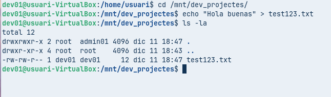
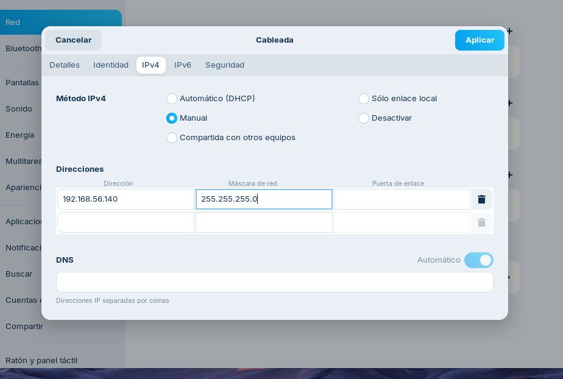
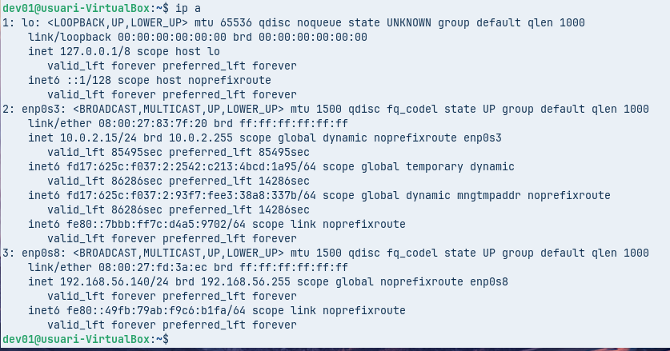
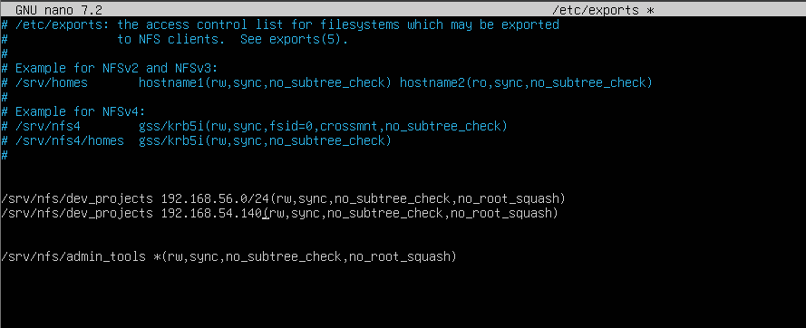

# T09: Guia NFS — Configuració d'usuaris, permisos i recursos compartits
Aquest document explica, pas a pas i de manera senzilla, com configurar un servidor NFS i un client Zorin, com gestionar usuaris i grups, posar permisos i muntar els recursos compartits.

1. Preparació de grups i usuaris al servidor

Creem els usuaris dev01 i admin01, els assignem als grups corresponents, amb el seu directori personal i amb la shell bash per defecte.

Creem els directoris de treball admin_tools i dev_projects.

Assignem el propietari i el grup a les carpetes (usuari root i grup admins o devs, segons correspongui) i configurem els permisos.

2. Configuració del servei NFS al servidor
Instal·lem NFS 

Definim els recursos que es volen compartir al fitxer /etc/exports.

Reiniciem el servei i comprovem l’estat del nfs-kernel-server.

Verifiquem els exports 

Verifiquem que els usuaris i els grups s’han creat correctament.

3. Preparació al client Zorin

Instal·lem l’eina “Users and Groups” per gestionar els usuaris localment.

Repliquem els usuaris i grups amb les mateixes UIDs i GIDs que al servidor.

Al servidor, creem un fitxer de prova dins del recurs compartit.

Actualitzem repositoris a Zorin.

Instal·lem nfs-common al client.

Llistem els recursos compartits del servidor amb showmount -e.

Creem la carpeta de muntatge 

Muntem el recurs compartit en la carpeta creada.

4. Proves de permisos i ajustos d'exports
Intentem crear un fitxer com a root des del client; si no és possible, cal afegir no_root_squash al fitxer /etc/exports.

Afegim el paràmetre no_root_squash al fitxer /etc/exports i apliquem els canvis.

Tornem a muntar i provem de crear un arxiu com a root de nou.

Modifiquem el fitxer /etc/exports per al recurs dev_projects: la xarxa 192.168.56.0 amb permisos d’escriptura i la IP 192.168.56.105 només amb permisos de lectura.

Reiniciem el servei i comprovem que arrenca correctament.

Creem la carpeta de muntatge per dev_projects i la muntem.

Com a usuari dev01, provem de crear un fitxer (hauria de ser possible a la xarxa amb permisos d’escriptura).

Canviem la IP per comprovar accés de només lectura.

Tornem a muntar el recurs.

Com a usuari dev01, provem d’escriure en un fitxer (no hauria de ser permès) i ho confirmem.

Amb admin tampoc ha de permetre l'escriptura.

5. Muntatge automàtic amb /etc/fstab
Configurem el fitxer /etc/fstab perquè els recursos es muntin automàticament a l’inici del sistema.

