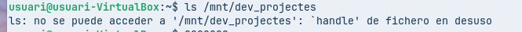
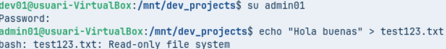
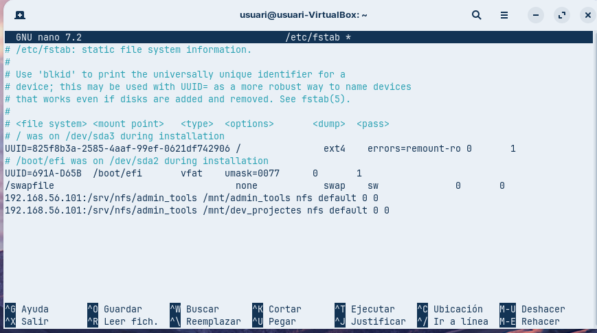
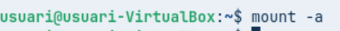
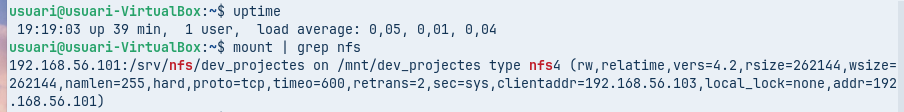

# Guia completa amb espais per a les fotos (45 fotos)

## 1. Creació de grups i usuaris

Afegim els grups **admins** i **devs**.

Afegim l’usuari **admin01** i l’assignem al grup admins.

Afegim l’usuari **dev01** i l’assignem al grup devs.

Verifiquem que els usuaris han estat creats.

Verifiquem que els grups existeixen.

---

## 2. Creació i configuració de directoris

Creem les carpetes:

* **admin_tools**
* **dev_projects**

Assignem **root** com a propietari dels directoris.

Assignem els grups **admins** i **devs**.

Comprovem permisos.

---

## 3. Instal·lació i configuració de NFS al servidor

Instal·lem:

apt install nfs-kernel-server

Editem **/etc/exports**.

Afegim els recursos inicials.

Reiniciem el servei.

Comprovem l’estat del servei:

systemctl status nfs-kernel-server

Verifiquem els exports:

exportfs -u

---

## 4. Configuració del client Zorin OS

Instal·lem *Users and Groups*.

Creem els mateixos grups que al servidor.

Creem els usuaris equivalents.

---

## 5. Prova inicial de recurs compartit

Creem un fitxer de prova a **admin_tools/** des del servidor.

Comprovem que el fitxer existeix.

---

## 6. Preparació del client Zorin

Actualitzem i instal·lem NFS:

apt update
apt install nfs-common

Mostrem els recursos exportats:

showmount -e <IP_SERVER>

Creem el punt de muntatge:

mkdir /mnt/admin_tools

Muntem el recurs:

mount <IP_SERVER>:/admin_tools /mnt/admin_tools

Intentem crear un fitxer com a root (fallada).

---

## 7. Afegim **no_root_squash**

Modifiquem **/etc/exports**:

no_root_squash

Reiniciem NFS:

Tornem a provar:

---

## 8. Configuració de permisos per xarxa (dev_projects)

Modifiquem **/etc/exports**:

* 192.168.56.0 → RW
* 192.168.56.105 → RO

Reiniciem:

Creem /mnt/dev_projects:

Muntem el recurs:

---

## 9. Proves d’escriptura segons xarxa

Amb **dev01**, provem de crear un fitxer:

Confirmem que s’ha creat.

Canviem la IP:

Tornem a muntar:

Provem d’escriure:

Amb admin tampoc podem escriure.

Comprovem que podem llegir.

---

## 10. Automuntatge amb /etc/fstab

Editem el fitxer:

Reiniciem el daemon:

systemctl daemon-reload

Fem:

mount -a

Comprovem que està muntat:

Reiniciem el sistema:

Comprovem que el muntatge és automàtic:

---

