# Guia de configuració NFS i gestió d’usuaris


Afegim els grups **admins** i **devs**.  


Creem l’usuari **dev01** i l’assignem al grup **devs**, amb el directori personal i **bash** com a shell per defecte.  


Creem l’usuari **admin01** i l’assignem al grup **admins**, amb el seu directori personal i shell **bash** per defecte.  


Creem els directoris **admin_tools** i **dev_projects**.  


Assignem la propietat dels directoris a **root** i el grup corresponent a **admins** o **devs**.  

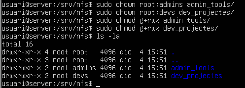

Instal·lem el servidor **NFS** (`nfs-kernel-server`).  


Definim els recursos compartits en `/etc/exports`.  

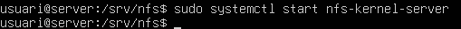

Comprovem l’estat del servei **nfs-kernel-server**.  


Verifiquem que els **exports** s’han creat amb `exportfs -u`.  


Comprovem que els usuaris i els grups s’han creat correctament.  

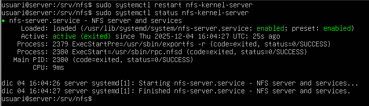

---

Al **client Zorin**, instal·lem **Users and Groups** per poder gestionar els usuaris.  


Creem els mateixos usuaris i grups amb les mateixes IPs que al servidor.  

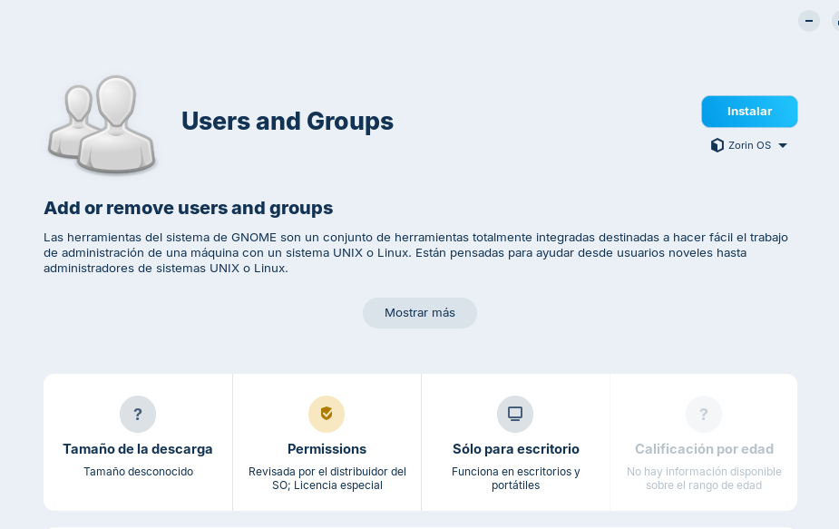

---

Creem un arxiu de prova amb contingut des del servidor al recurs compartit `admin_tools/`.  

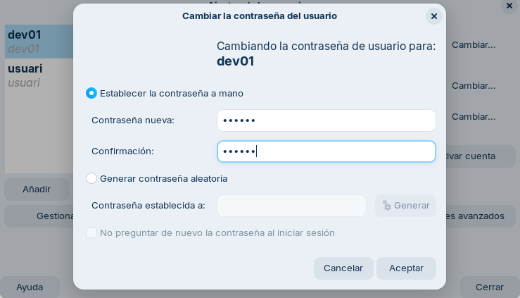

---

Actualitzem els repositoris de Zorin.  

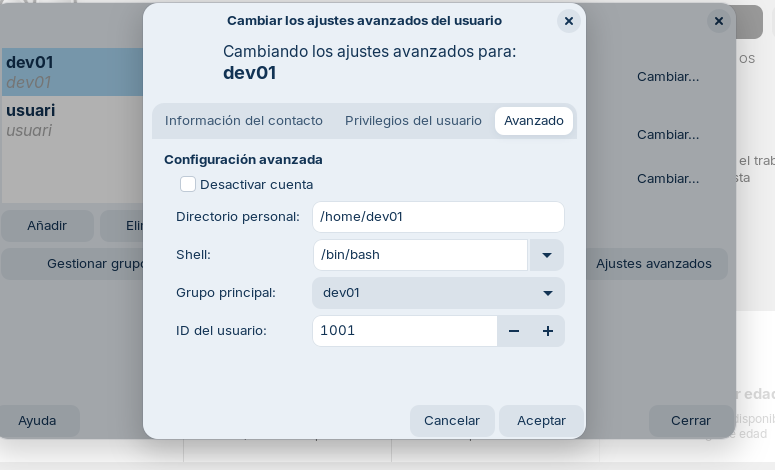

Instal·lem `nfs-common`.  

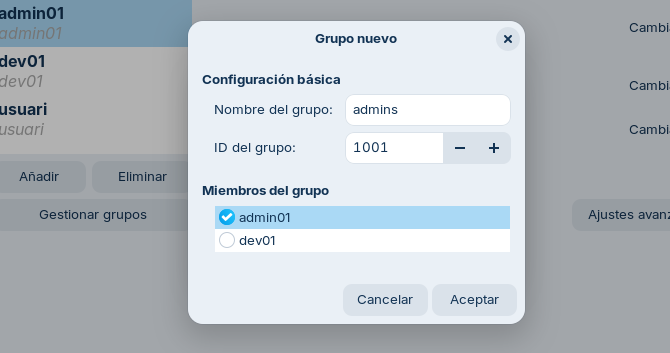

Fem `showmount -e <IP_SERVER>` des del client Zorin per veure els recursos compartits disponibles.  


Creem la carpeta de muntatge: `/mnt/admin_tools`.  

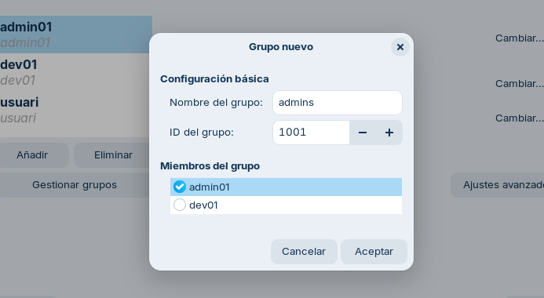

Muntem el recurs compartit a la carpeta que acabem de crear.  

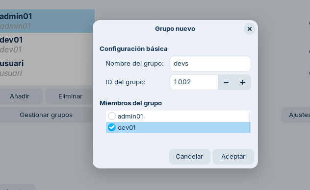

Intentem crear un arxiu com a **root**; no ens deixa, així que afegirem l’opció **no_root_squash**.  


Afegim el paràmetre `no_root_squash` als **exports**.  


Ara tornem a provar de crear un arxiu i ja ens deixa, ja que estem actuant com a root en el recurs compartit gràcies a `no_root_squash`.  

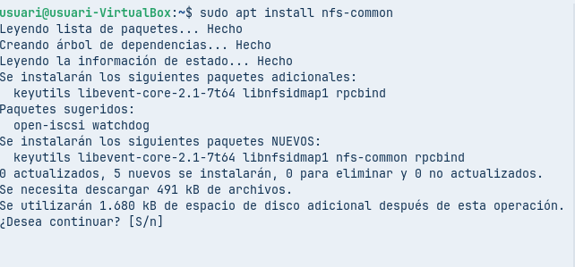

---

Modifiquem `/etc/exports` al servidor per ajustar el recurs `dev_projects`:  

* La xarxa **192.168.56.0** tindrà permisos d’escriptura (RW).  
* L’altra xarxa **192.168.56.105** només podrà llegir (RO).  

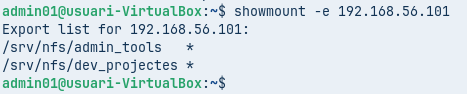

Reiniciem el servei i comprovem que s’inicialitza correctament.  


Creem la carpeta per muntar el nou recurs `dev_projects` i la muntem.  


---

Com a usuari **dev01**, intentem crear un arxiu; ens hauria de deixar.  


Confirmem que efectivament es crea. Ara canviem la IP per verificar si només es permet llegir.  

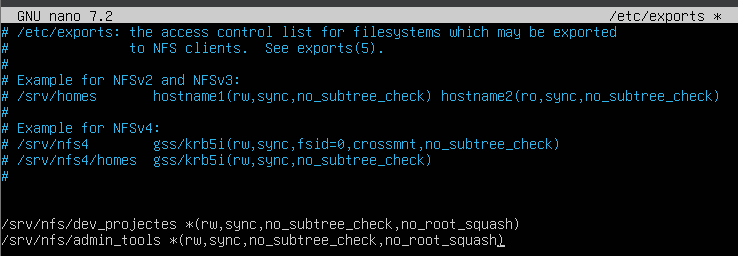

Comprovem que tenim la IP correcta.  


Tornem a muntar el recurs.  


Ara, amb el mateix usuari **dev01**, provem d’escriure a un arxiu; no hauria de deixar i efectivament no deixa.  


Comprovem que amb l’usuari **admin** tampoc es pot escriure.  

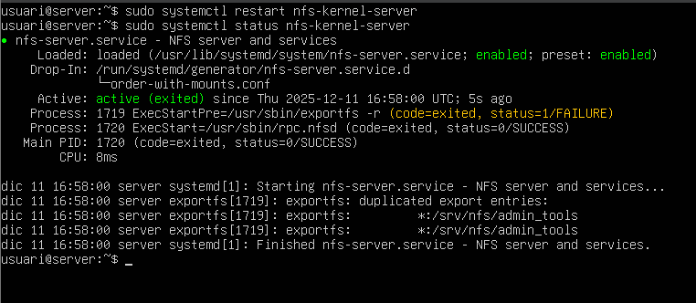

---

Configurem el fitxer `/etc/fstab` per fer que els recursos es muntin automàticament en iniciar sessió, evitant haver de muntar-los manualment.  

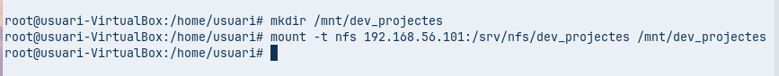

Reiniciem el daemon:

```bash
systemctl daemon-reload
